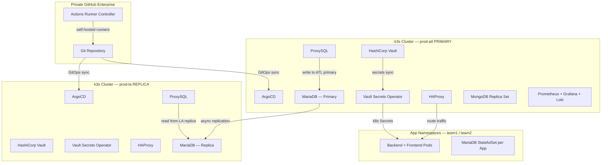

# k3s Platform — Air-Gapped GitOps Infrastructure

Production-grade Kubernetes platform running on **k3s** inside a **private network zone with no direct internet access**. All container images, Helm charts, and packages are sourced exclusively from internal private Artifactory registries and a private GitHub Enterprise instance. This repository is a full Infrastructure-as-Code showcase covering multi-cluster GitOps, secrets management, observability, database replication, and self-hosted CI/CD.

---

## Table of Contents

- [Architecture Overview](#architecture-overview)
- [Tech Stack](#tech-stack)
- [Repository Structure](#repository-structure)
- [Multi-Cluster / Multi-Environment Setup](#multi-cluster--multi-environment-setup)
- [GitOps with ArgoCD](#gitops-with-argocd)
- [CI/CD Pipeline](#cicd-pipeline)
- [Secrets Management](#secrets-management)
- [Networking](#networking)
- [Database Layer](#database-layer)
- [Observability](#observability)
- [Security & RBAC](#security--rbac)
- [Adapting This Repo](#adapting-this-repo)

---

## Architecture Overview



---

## Tech Stack

| Layer | Technology |
|---|---|
| **Kubernetes** | k3s (HA, multi-master) |
| **GitOps** | ArgoCD — App-of-Apps pattern |
| **CI/CD Runners** | GitHub Actions + Actions Runner Controller (ARC) on k3s |
| **Secrets** | HashiCorp Vault + Vault Secrets Operator (VSO) |
| **Ingress / LB** | HAProxy (deployed in-cluster via kube-system) |
| **DB Proxy** | ProxySQL — read/write split + cross-cluster routing |
| **Relational DB** | MariaDB (StatefulSet per app, async cross-cluster replication) |
| **Document DB** | MongoDB (Replica Set, StatefulSet) |
| **Metrics** | Prometheus + cAdvisor + Metrics Server |
| **Dashboards** | Grafana (dashboards as code) |
| **Logging** | Loki + Promtail |
| **Alerting** | Alertmanager → webhook receiver |
| **Storage** | Longhorn (distributed) + local-path provisioner |
| **Packaging** | Helm — shared library chart + per-app charts |
| **Registry** | Private Artifactory (all images air-gapped) |
| **DNS** | CoreDNS (customised) |

---

## Repository Structure

```
.
├── .github/
│   └── workflows/
│       ├── helm-dep-update.yaml   # Auto-updates Helm chart dependencies on push
│       └── test-runner.yaml       # Smoke-tests the self-hosted runner environment
│
├── argocd/
│   ├── apps/                      # ArgoCD Application manifests (App-of-Apps roots)
│   │   ├── app-of-apps-teams.yaml
│   │   ├── app-of-apps-vulcan.yaml
│   │   ├── team1/                 # Per-app ArgoCD Applications for team1 (app1–app8, MongoDB)
│   │   └── vulcan/                # Platform-level ArgoCD Applications
│   │
│   ├── teams/
│   │   ├── charts/                # Helm charts — one per app + shared library chart
│   │   │   ├── teams-common/      # Library chart: reusable templates for all apps
│   │   │   ├── app1/ … app8/      # Per-app charts (depend on teams-common)
│   │   ├── mongodb/               # MongoDB Helm chart
│   │   └── shared-data-apps/      # VSO manifests — secret sync for app namespaces
│   │
│   └── vulcan/                    # Platform component Helm charts + manifests
│       ├── actions-runner-controller/
│       ├── actions-runner-set/
│       ├── db-replication-check/  # CronJob: MariaDB replication health → Pushgateway
│       ├── grafana/
│       ├── logging/               # Loki + Promtail
│       ├── monitoring/            # Prometheus + Alertmanager + cAdvisor + Pushgateway
│       └── vault/
│
├── infra/                         # Cluster bootstrap manifests (applied once, not via ArgoCD)
│   ├── argocd/                    # ArgoCD install + AppProject definitions
│   ├── kube-system/
│   │   ├── coredns/
│   │   ├── haproxy/               # HAProxy DaemonSet + per-env configs
│   │   ├── metrics-server/
│   │   ├── proxysql/              # ProxySQL StatefulSet + per-env configs
│   │   └── secrets/               # VSO VaultAuth manifests per namespace per env
│   ├── namespaces/                # Namespace definitions + ResourceQuotas + LimitRanges
│   ├── persistent_storage/        # Longhorn + local-path StorageClass
│   └── security/
│       ├── rbac/                  # ClusterRoles + RoleBindings per team
│       └── vault-secrets-operator/
│           ├── vaultconnections/  # VaultConnection CRDs (one per namespace)
│           └── cluster-rbac-tokenreview/
│
├── db_test/                       # Standalone MariaDB replication test manifests (dev use)
├── docs/                          # Runbooks, architecture notes, operational guides
│   ├── variables.txt              # All placeholder variables used across this repo
│   └── maintenance/               # MOP procedures, VM maintenance guides
└── etc/
    └── systemd/                   # k3s systemd service environment overrides
```

---

## Multi-Cluster / Multi-Environment Setup

The platform runs across **four environments**, each mapping to a separate k3s cluster or namespace context:

| Environment | Purpose |
|---|---|
| `dev` | Development — relaxed limits |
| `test` | Integration testing |
| `prod-la` | Production — LA site (replica DB, read traffic) |
| `prod-atl` | Production — ATL site (primary DB, write traffic) |

Each Helm chart carries per-environment value files (`values/dev.yaml`, `values/test.yaml`, `values/common.yaml`). ArgoCD ApplicationSets select the correct value file per target cluster using `{{env}}` parameters.

All environment-specific endpoints, node addresses, and FQDN values are **never hardcoded** — they are parameterised using the variables defined in [`docs/variables.txt`](docs/variables.txt) and injected at deploy time.

---

## GitOps with ArgoCD

The repo follows the **App-of-Apps** pattern — two root Applications bootstrap everything else:

- **`app-of-apps-vulcan`** — deploys all platform components (Vault, Grafana, Loki, Prometheus, HAProxy, ProxySQL, ARC)
- **`app-of-apps-teams`** — deploys all tenant application stacks (app1–app8, MongoDB, shared secrets)

ArgoCD is configured with:
- **AppProjects** for RBAC isolation between `vulcan` (platform) and `teams` (applications)
- **Multi-source Applications** — Git repo + Helm values repo combined
- **Per-namespace VaultConnections** — each namespace has its own Vault auth path
- **Automated sync** with self-heal enabled for platform components

---

## CI/CD Pipeline

All CI jobs run on **self-hosted GitHub Actions runners deployed inside the k3s cluster** via the Actions Runner Controller (ARC). Runners have no outbound internet access — they reach only the internal GitHub Enterprise and Artifactory.

### Helm Dependency Update ([`.github/workflows/helm-dep-update.yaml`](.github/workflows/helm-dep-update.yaml))

Triggered on push to `dev`, `test`, or `main` when `Chart.yaml` files change.

**Logic:**
1. Detects whether the shared `teams-common` library chart changed
2. If yes → re-runs `helm dependency update` on **all** app charts (their bundled `.tgz` is stale)
3. If no → updates only the specific chart whose `Chart.yaml` changed
4. Commits and pushes updated `charts/*.tgz` back to the branch (`[skip ci]`)

This ensures the library chart change propagates to all dependent app charts atomically, without manual intervention.

### Test Runner ([`.github/workflows/test-runner.yaml`](.github/workflows/test-runner.yaml))

Smoke-tests the self-hosted runner environment — verifies the pod can reach `kubectl`, reports node and kernel info.

### DB Replication Check ([`argocd/vulcan/db-replication-check/`](argocd/vulcan/db-replication-check/))

A scheduled CronJob (not a GitHub workflow) that connects to every MariaDB StatefulSet in the cluster, runs `SHOW SLAVE STATUS`, and pushes a `mysql_replication_healthy` gauge to the Prometheus Pushgateway. Alertmanager fires if replication breaks or if the CronJob itself goes stale.

---

## Secrets Management

**No secrets are stored in this repository.** All secrets live in HashiCorp Vault and are synced into Kubernetes at runtime by the **Vault Secrets Operator (VSO)**.

```
Vault KV-v2  →  VaultStaticSecret CRD  →  Kubernetes Secret  →  Pod env / volume
```

**Per-namespace isolation:**
- Each namespace has its own `VaultConnection` (pointing to Vault with namespace-scoped auth)
- Each namespace has its own `VaultAuth` (Kubernetes ServiceAccount auth method)
- Policies in Vault restrict each namespace to only its own secret paths
- Secrets refresh automatically on a configurable interval (typically 1–5 minutes)

**Secret categories managed via VSO:**
- App TLS certificates (`team1-certs`)
- DB root + replication passwords (`team1-database-roots`)
- App-level credentials (`team1-shared-app-secrets`)
- MongoDB credentials
- ArgoCD Git repository SSH keys
- ProxySQL admin/monitor passwords
- GitHub PAT for ARC runners

---

## Networking

### HAProxy (in-cluster)
- Deployed as a DaemonSet in `kube-system` with `hostNetwork: true`
- Single external IP per site routes all traffic: HTTPS apps, ArgoCD, Vault, MongoDB, ProxySQL admin
- Config is stored as a ConfigMap per environment — no external load balancer required
- TLS termination at HAProxy for frontend apps; passthrough for Vault/ArgoCD

### ProxySQL (in-cluster)
- Deployed as a StatefulSet in `kube-system`
- Provides **read/write splitting**: writes go to the ATL primary via NodePort, reads stay local
- **Automatic failover**: on ATL primary failure, the config is patched to promote the LA replica as the new write target (documented in [`docs/mariadb_failover.md`](docs/mariadb_failover.md))
- One hostgroup per application database — full query routing isolation between apps
- Credentials injected at startup via an `initContainer` that substitutes `__ADMIN_PASS__` / `__MONITOR_PASS__` placeholders from a Vault-synced Secret

### CoreDNS
- Custom configuration deployed as a managed manifest (not k3s default)
- Tuned for in-cluster service resolution across namespaces

---

## Database Layer

### MariaDB (per-app)
- Each application runs its own **MariaDB StatefulSet** (primary on ATL, async replica on LA)
- Replication credentials provisioned via an `initContainer` that runs at pod startup
- Headless Service for stable DNS inside the cluster; NodePort for cross-cluster replication traffic
- The `teams-common` library chart provides reusable `_db_sts.tpl`, `_db_svc_headless.tpl`, and `_db_configmap_init_scripts.tpl` templates — adding a new database requires only a few lines in the app's `values.yaml`

### MongoDB
- Single Replica Set deployed as a StatefulSet in the `team1` namespace
- TLS enabled; credentials synced from Vault via VSO
- Accessible externally via HAProxy NodePort routing

### Cross-Cluster Replication Monitoring
- CronJob runs every 15 minutes, connects to every MariaDB pod over the cluster network
- Pushes `mysql_replication_healthy{namespace,db}` and `mysql_replication_configured` to Prometheus Pushgateway
- Grafana dashboard shows replication lag and status per database
- Alertmanager fires `MySQLReplicationBroken` and `MySQLReplicationCheckStale` alerts

---

## Observability

| Component | Role |
|---|---|
| **Prometheus** | Metrics scraping — pods, nodes, cAdvisor, Pushgateway |
| **Grafana** | Dashboards as code — cluster, app, and DB replication dashboards |
| **Loki** | Log aggregation |
| **Promtail** | Log shipping from all pods to Loki |
| **Alertmanager** | Alert routing → webhook (Flask API receiver) |
| **Pushgateway** | Receives metrics from batch jobs (DB replication check, cron jobs) |
| **Metrics Server** | `kubectl top` and HPA support |

Grafana dashboards are stored as ConfigMaps in the repo under [`argocd/vulcan/grafana/dashboards/`](argocd/vulcan/grafana/dashboards/) and loaded via the Grafana sidecar at startup — no manual dashboard import needed.

---

## Security & RBAC

- **Namespace isolation**: each team namespace has its own ResourceQuota and LimitRange
- **RBAC**: ClusterRoles and RoleBindings defined per team; developers have namespace-scoped access only
- **Zero plaintext secrets**: all secret values come from Vault; the repo contains only VSO CRD manifests with Vault path references
- **TLS everywhere**: app-to-app communication uses certificates synced from Vault; HAProxy terminates external TLS
- **Air-gapped runners**: GitHub Actions pods have no internet access — only internal registry and GitHub Enterprise reachable
- **Vault Kubernetes auth**: each workload authenticates to Vault using its Kubernetes ServiceAccount JWT, scoped to its own namespace

---

## Adapting This Repo

All environment-specific values are abstracted behind placeholder variables documented in [`docs/variables.txt`](docs/variables.txt). To adapt this for your own environment, substitute:

| Variable | Description |
|---|---|
| `$FQDN` | Your Vault / cluster FQDN |
| `$ARTIFACTORY` | Private container registry hostname |
| `$PROXY` | Internal HTTP/HTTPS proxy |
| `$PRIVATE_GH_FQDN` | Private GitHub Enterprise FQDN |
| `$NODE_1` … `$NODE_7` | Cluster node hostnames |
| `$IP_ADDR` / `$IP_ADDR2` | External node IPs for HAProxy/ProxySQL backends |
| `$TEAM1` / `$TEAM2` | Namespace / team names |
| `$TOOLING_ACCOUNT_ID` | Service account for CI tooling |
